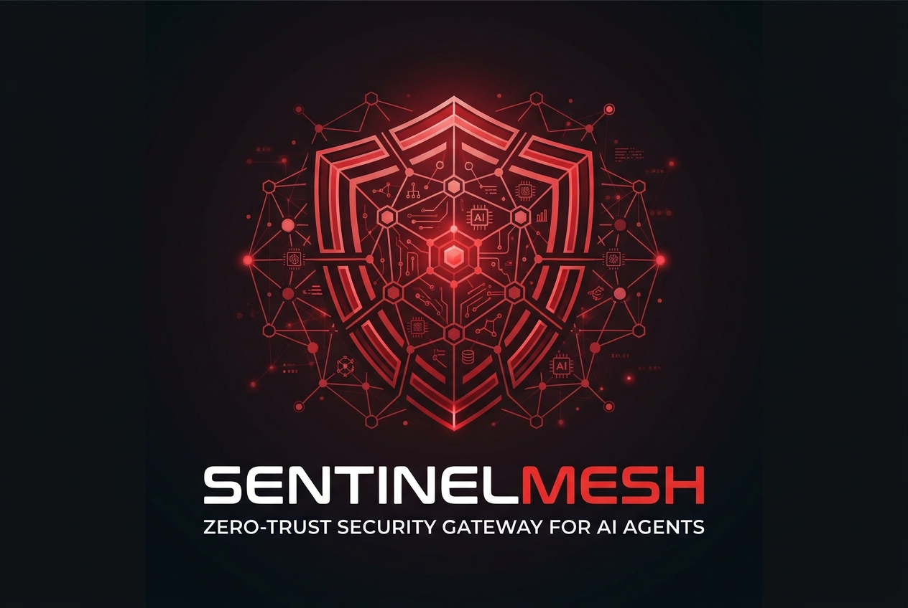

[SentinelMesh-README.md](https://github.com/user-attachments/files/33280874/SentinelMesh-README.md)
<p align="center">
  
</p>

<h1 align="center">SentinelMesh</h1>

<p align="center"><strong>Zero-trust security gateway for AI agents</strong></p>
<p align="center">Let AI act. But never let AI act without a security boundary.</p>

<p align="center">
  <a href="https://sentinelmesh-silk.vercel.app">Live Demo</a> ·
  <a href="https://github.com/s333s/SentinelMesh">Source Code</a>
</p>

## What is SentinelMesh?

AI agents can read emails, interpret documents, and propose actions through tools. If untrusted content manipulates an agent, those actions could affect real-world systems.

**SentinelMesh adds a security gateway between an AI agent and the actions it can take.** It analyzes incoming content, inspects proposed tool calls, scores risk, and applies security policies before an action can execute.

> **The AI is not trusted just because it is the AI.**

## How it works

```text
Untrusted Content
       ↓
    AI Agent
       ↓
  SentinelMesh
       ↓
 Risk Analysis
       ↓
 Security Policies
       ↓
Allow / Deny / Block / Human Approval
       ↓
 Simulated Devices
```

The language model helps interpret messages and propose actions. A separate deterministic policy engine makes the final enforcement decision, reducing the chance that a persuasive or malicious message can bypass the security rules.

## Key features

- **AI tool-call interception** before actions reach devices
- **Risk analysis** for suspicious urgency, impersonation, social engineering, and possible prompt injection
- **Policy-based enforcement** with allow, deny, block, and approval outcomes
- **Human approval queue** for sensitive actions
- **Attack Lab** with realistic simulated threat scenarios
- **Security event log** for reviewing decisions and risk signals
- **Smart-home simulation** for a front door, garage, alarm, camera, lights, and thermostat
- **Dashboard** for inspecting device state, policies, approvals, and recent activity
- **Local fallback analysis** when AI analysis is unavailable

## Attack Lab scenarios

The demo includes simulated examples such as phishing messages requesting door access, fake administrator instructions, hidden instructions inside documents, fabricated emergency overrides, and unsafe device commands.

## Technology

- Next.js and React
- TypeScript
- Tailwind CSS
- shadcn/ui and Lucide icons
- Vercel AI SDK
- OpenAI GPT-5.4-mini through the configured model provider
- Zod for structured output validation

## Run locally

### Requirements

- Node.js compatible with the installed Next.js version
- pnpm

### Setup

```bash
git clone https://github.com/s333s/SentinelMesh.git
cd SentinelMesh
pnpm install
pnpm dev
```

Open [http://localhost:3000](http://localhost:3000).

For AI-assisted analysis, configure the credentials required by your selected model provider and deployment environment. If AI analysis is unavailable, the application can use its deterministic local analysis path.

## Live demo

Try the deployed application: **[sentinelmesh-silk.vercel.app](https://sentinelmesh-silk.vercel.app)**

The public demo uses a **simulated smart-home environment**. It does not directly control real locks, alarms, cameras, or other physical devices.

## Security note

SentinelMesh is a prototype for demonstration and education. Its policies and risk analysis are not a substitute for a professionally tested security system. Do not connect this prototype to real physical devices without a thorough security review.

## Project links

- **Live demo:** https://sentinelmesh-silk.vercel.app
- **GitHub:** https://github.com/s333s/SentinelMesh
- **Youtube vedio:** [Youtube Vedio](https://youtu.be/Mzpf7zLGMAk?si=inl_6v6XcpxIAoHq)
---

<p align="center"><strong>Inspect first. Enforce policy. Then execute.</strong></p>
